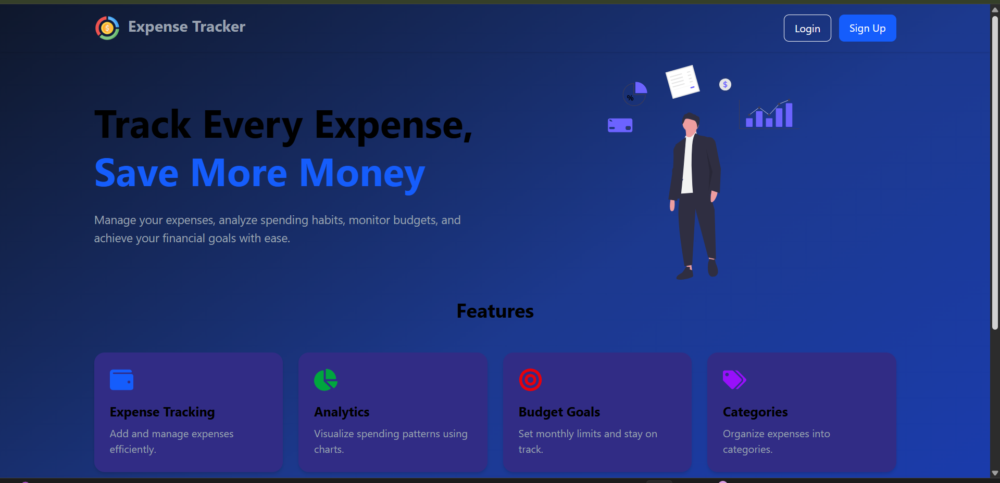
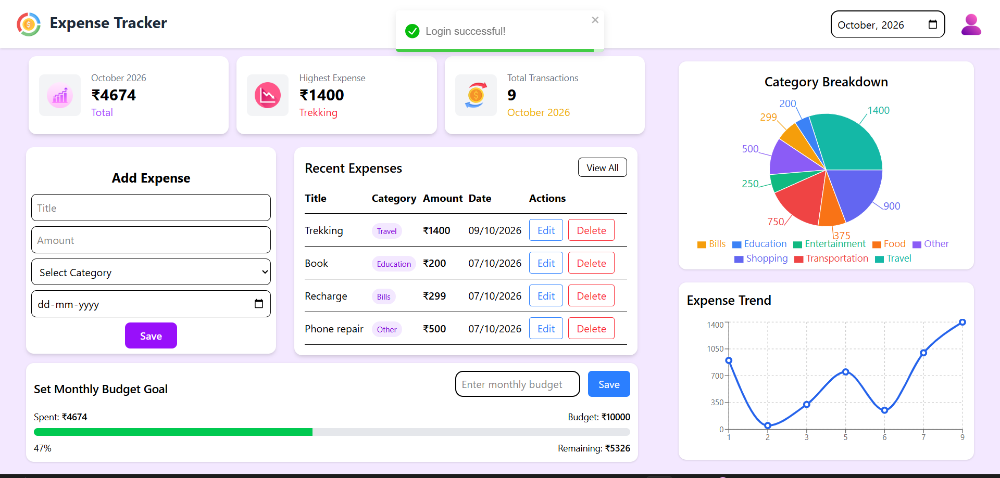
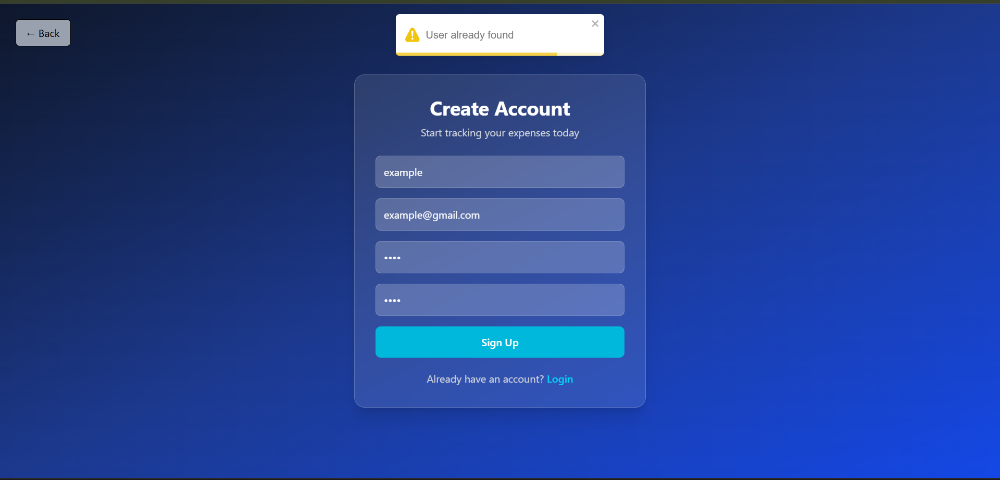
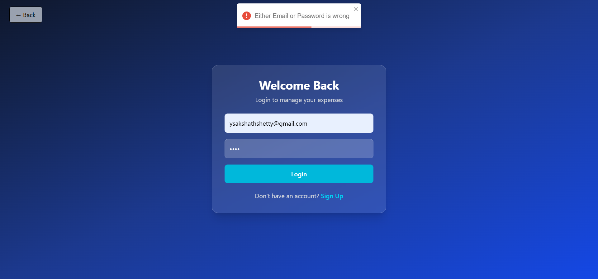

A full-stack MERN Expense Tracker application.

## Features
- User Authentication (JWT)
- Add Expenses
- Edit Expenses
- Delete Expenses
- Category-wise Expense Pie Chart
- Monthly Expense Graph
- Set budget limits and monitor expense

## Tech Stack
- React.js
- Node.js
- Express.js
- MongoDB
- Tailwind css

## Installation

### Backend
cd backend
npm install
npm start

### Frontend
cd frontend/expense
npm install
npm run dev
## Screenshots

### Homepage

### Dashboard

### SignUp Page

### Login Page

